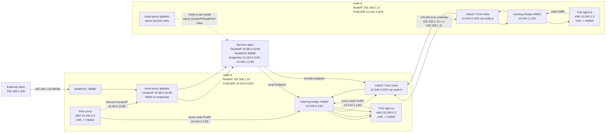

# Minik8s

作者：Popc0rn

---

Minik8s 是一个面向云OS Lab 的轻量容器编排系统。项目目标参考Kubernetes。

使用Go语言实现。一个舰桥 `bridge` 控制面加多个 Node Agent 水手`sailer`，用户通过单独的 `kubectl` 二进制用 Kubernetes 风格命令管理 Pod、Service、ReplicaSet、Node等对象，并在 Linux + Docker 环境中演示 Pod 网络、Service 转发和控制面状态恢复。

课程规格以 [docs/Handout.md](docs/Handout.md) 为准。在个人时间和能力的取舍下凝练到当前的功能版本，并在答辩中演示核心功能和架构设计。

## 系统架构

系统的整体架构基本参照Kubernetes的经典组件划分，但重新设计了组件名称和边界，以适应个人实现思路。

### 控制面 与 Bridge

> Bridge是一个舰队的指挥中心

整个Minik8s的编排都要依赖控制面Bridge，Bridge本身只是一个平台，组合控制面组件，保证协同以及组件启停的一致性。

**Bridge的核心组件包括：**
- Harbor: 提供Kubernetes-like API，服务资源的CRUD接口，以及节点心跳和节点metrics接口。
- Logbook: 控制面状态存储，可选提供in-memory、file和etcd后端。
- Navigator: 轻量调度器。
- Captain：控制器集群，当前包括Service endpoint controller、ReplicaSet controller和HPA controller。

> Image: Bridge

### Harbor港湾

> Harbor是船只调度的集散地，船只在此流动。

Harbor 是 Bridge 对外暴露的 Kubernetes-like API Server 子集。`kubectl`、
`sailer` 和 addon controller 都通过 Harbor 读写对象或回写状态，当前 API 覆盖
Pod、Service、ReplicaSet、Node、HPA、DNS、Job 以及 Serverless 的
Function/EventTrigger/Workflow。

Harbor 的接口按资源分组组织，同时保留节点侧专用通道：Node join 会签发并校验
token；`sailer` 心跳会携带 Node 地址、PodCIDR 和本地状态；metrics 接口接收
Docker CPU/Memory 采样，并供 HPA 与 `kubectl top` 风格查询复用。它不是完整的
Kubernetes apiserver，没有 admission、RBAC、完整 watch/resourceVersion 语义等
API machinery。

> Image: Harbor API surface

### Logbook日志簿

> Logbook记录了航海日志，保存了船只的状态和历史。

Logbook 是控制面的状态存储抽象，向 Harbor、Navigator 和 Captain 提供统一的对象
CRUD 接口。默认使用本地 JSON 文件保存声明式对象，便于单机演示和控制面重启恢复；
设置 `MINIK8S_LOGBOOK_ENDPOINTS` 后切换到 etcd-backed store，使 Pod、Service、
ReplicaSet、HPA、DNS、Node 等资源写入 `/registry/...` 前缀。

Logbook 目前强调教学闭环：对象持久化、基本并发保护、重启后恢复和少量 etcd watch
测试已经具备；但没有实现完整 Kubernetes storage layer、resourceVersion
一致性模型或历史版本保留。

### Navigator导航

> Navigator是船只的导航员，负责指派船只和任务。

Navigator 是 Bridge 内的轻量调度器。Pod 创建后先进入 Pending 状态，Navigator
根据当前 Ready Node 列表为未绑定 Pod 写入 `spec.nodeName`，让对应节点的 `sailer`
在下一轮 reconcile 中拉取并运行该 Pod。

当前调度策略保持简单：主要按 Ready Node 做基础分配，避免把新 Pod 调度到
Unknown Node；尚未实现资源感知调度、亲和/反亲和、污点容忍或抢占。这样的边界足够支撑
多机 Pod、ReplicaSet、Service 和 HPA 的主路径演示。

> Image: Pod scheduling flow

### Captain船长

> Captain是舰队的船长，负责时刻管理舰队中的船只行为。

Captain 对应 controller-manager 子集，负责把声明式对象持续收敛到期望状态。当前
controller 包括 Service endpoint controller、ReplicaSet controller、HPA
controller 和 Node lifecycle controller：前者维护 Service endpoints，ReplicaSet
补齐或删除副本，HPA 根据 Docker metrics 调整 ReplicaSet replicas，Node lifecycle
把超时心跳的节点标记为 Unknown 并清理相关服务端点。

控制器由统一 Runner 驱动。各 controller 有独立周期和按需触发入口，但 store-heavy
同步会通过全局队列串行化，避免多个控制器同时改写相同对象时产生难以复现的竞态。

### Worker Node 与 Sailer

> Sailer是船只上的水手，负责执行船长的命令，执行实际任务并管理船只航行和运作状态。

Worker Node是Minik8s的工作节点，负责运行用户的Pod和Service的单元。每个Worker Node上运行一个Sailer agent，负责管理Docker容器、CNI网络、Pod状态和kube-proxy规则。

Sailer的核心责任包括：

- 通过 `sailer join` 向 Harbor 注册 Node，并在运行期持续发送 heartbeat。
- 周期性拉取分配给本节点的 Pods，创建 Docker sandbox 和 workload 容器。
- 按 Pod `restartPolicy` 处理容器退出、基础 probe 和状态回写。
- 获取控制面分配的 PodCIDR，写入本机 CNI 配置并调用 CNI runner。
- 同步跨节点 VXLAN/route 信息，使不同 Node 的 PodCIDR 可互通。
- 拉取 Service 列表并驱动本机 kube-proxy 写入或清理 iptables 规则。
- 上报 Docker CPU/Memory metrics，供 HPA 和 metrics API 使用。

> Image: Sailer

### kube-proxy

Minik8s 的 kube-proxy 是 `sailer` 内部的数据面同步组件，负责把 Service 对象转换为
节点本地 iptables NAT 规则。Service controller 先在控制面维护 selector
endpoints，`sailer` 再把 ClusterIP、NodePort 和 endpoint 列表同步到本机规则中，
从而让虚拟 IP 或宿主机端口转发到后端 Pod IP。

当前实现支持 ClusterIP、NodePort 和多 endpoint 的简单负载均衡，适合展示 Service
抽象和数据面闭环；NodePort 多节点 SNAT/回包、多协议、session affinity、traffic
policy 等完整 Kubernetes 语义尚未实现。无 root 或无 iptables 环境下可以通过
`sailer --proxy-disabled` 只验证对象与 endpoints。

> Image: Service dataplane

下面的网络架构图只关注数据面：Pod 如何通过 CNI 接入本机 bridge、如何经由
kube-proxy 访问 Service，以及跨节点 PodCIDR 如何通过 VXLAN/route 互通。



### CNI能力 与 网络插件 Mooring

> Mooring是船只的锚点，锚定船只，提供稳定的网络通信。

由于题目理解问题，最初自己实现了一套CNI插件+CNI基座的混合组件，后续为了支持如Flannel的其他插件插拔，拆分了CNI能力为内部基座和CNI插件Mooring，提供单节点和跨节点的网络能力。

Minik8s改造了CNI插件接口，把编译好的Mooring插件上传到DockerHub上，使得用户可以凭借常规的`kubectl apply xxx.yaml`的CNI配置模式来接入使用Mooring CNI插件。

当前网络闭环分为四层：

- `cmd/mooring/`、`internal/cniplugin/`：实现 CNI `ADD`/`DEL`/`CHECK`，创建 bridge、veth、Pod IP、默认路由和 NAT。
- `internal/cni/`：读取 CNI conf 目录，执行单插件配置或基础 conflist 插件链。
- `internal/sailer/`：注册 Node，获取控制面分配的 `spec.podCIDR`，写入节点本地 CNI 配置，并在 Pod sandbox 创建/删除时调用 CNI runner。
- `internal/netagent`：通过 Harbor 节点信息同步 VXLAN/FDB/route，让不同节点 PodCIDR 可互通。

默认 CNI 配置目录是 `/etc/cni/net.d`，插件目录是 `/opt/cni/bin`，可分别用 `MINIK8S_CNI_CONF_DIR` 和 `MINIK8S_CNI_BIN_DIR` 覆盖。`make build` 默认把 `mooring` 构建到 `.minik8s/cni/bin/mooring`；真实 root 网络测试需要安装到 `/opt/cni/bin/mooring`，或显式覆盖插件目录。

当前支持三种模式：默认内置 mooring 模式、`manifest/cni/mooring.yaml` 激活的自研 CNI 模式、flannel 兼容模式。CNI 和 kube-proxy 依赖 Linux network namespace、`ip`、`bridge`、`iptables`、`nsenter` 和通常的 root 权限；只演示控制面对象和 Pod lifecycle 时，可以使用 `MINIK8S_CNI_DISABLED=1` 或 `sailer --proxy-disabled` 降低环境要求。

### Addons

万物皆对象，塞进Bridge里的拓展能力也可以以Addon的形式声明和管理。当前很多强大的功能都是通过实现了DNS、metrics和serverless三个Addon，分别提供域名解析、资源监控和Serverless能力，用户可以按需启用。


## Feature

### Bridge BootStrap & Node Join

Bridge 启动时会先完成控制面依赖和本地状态目录初始化：`minik8s init` 生成
`.minik8s/` 下的 static pod manifests、DNS/metrics/serverless addon manifests 和
运行配置；`minik8s bridge` 默认通过私有本地 `sailer` 拉起核心依赖 Pod，然后启动
Harbor、Navigator 和 Captain。启用 addon 时，Bridge 会按 `--addons` 加载对应
manifest，而不是默认全部运行。

Node Join 是多机闭环的入口。控制面通过 `bridge token set` 维护 join token，
worker 用 `sailer join --apiserver ... --token ... -f manifest/node/*.yaml` 注册
Node；Harbor 分配或校验 PodCIDR，并在后续 heartbeat 中把 Node 标记为 Ready。
心跳超时后 Node 会转为 Unknown，新 Pod 调度会避开该节点，Service endpoints 也会随
controller 收敛。

> Image: Bridge bootstrap and node join sequence

### CICD

本项目使用 GitHub Actions 做工程验证和发布：

- `ci.yml`：在 Pull Request 和 `main` push 时执行格式检查、lint、`go vet`、race test 和 build。
- `release.yml`：推送 `v*` tag 时交叉编译 Linux `amd64/arm64` 的 `minik8s` 和 `kubectl`，生成压缩包、`SHA256SUMS` 和 GitHub Release。
- `docker-image.yml`：在 `main` push 或手动触发时构建并发布 `ghcr.io/popc0rn7/minik8s` 和 `ghcr.io/popc0rn7/mooring-cni`。
- `ai-summary.yml`：在功能分支生成非阻塞的 AI 变更摘要；需要 repository secret `ZAI_API_KEY` 才会真实调用模型。

本地等价验证命令包括：

```bash
golangci-lint fmt --diff
golangci-lint run
go vet ./...
go test -race -covermode=atomic -coverprofile=coverage.out ./...
go build ./...
```

镜像发布只表示可分发运行入口。运行 `sailer` 仍需要宿主机提供 Docker daemon、Linux 网络工具、CNI 目录、iptables 权限以及必要的 bind mount；`mooring-cni` 镜像只用于安装自研 CNI 插件。

### HPA

HPA 是课程版资源监控与动态伸缩实现。用户通过 `kind: HorizontalPodAutoscaler`
声明目标 ReplicaSet、`minReplicas`/`maxReplicas` 和 CPU/Memory utilization 目标；
`sailer` 周期性读取 Docker stats 并上报到 Harbor，HPA controller 读取新鲜 metrics
后调整 ReplicaSet 的 `spec.replicas`，再由 ReplicaSet controller 完成 Pod 数量收敛。

当前算法采用教学版简化策略：只支持 ReplicaSet target 和 CPU/Memory resource
utilization，多指标取更大的 desired replicas，每轮最多扩缩 1 个副本，并带有缩容
冷却。它不是完整 metrics-server/cAdvisor/API aggregation/HPA behavior 实现，也不应
宣称支持资源 HPA 的 0 到 N 冷启动。

> Image: HPA metrics and reconcile loop

### Serverless

Serverless 是当前自选功能的教学版闭环。Minik8s 将 Function、EventTrigger 和
Workflow 都建模为一等资源，接入 YAML loader、Harbor API、CLI、file/etcd store 和
演示 manifest。Function 支持 Python 与容器镜像运行时；启用 `serverless` addon 后，
Bridge 会启动 NATS 依赖、invocation worker 和 serverless controller，CLI invoke 通过
NATS request/reply 触发后端 Function Pod。

当前版本覆盖 Function CRUD/invoke、EventTrigger 订阅 NATS subject 并触发 Function 或
Workflow、Workflow invoke subresource、WorkflowRun 执行记录、顺序步骤与基于输出的
条件跳转/merge、冷启动、按并发扩容和空闲后缩到 0。它仍是简化实现：事件
ack/retry/dead-letter、完整 DAG、durable execution、Kubernetes 级别的
Knative/Serverless 语义尚未实现。

> Image: Serverless resource model

### Watch & Heartbeat

Heartbeat 是控制面和数据面的容错基础。`sailer` 通过节点 Pod 拉取接口持续上报
Node 状态，Harbor 记录 `lastHeartbeat`、Node 地址和 PodCIDR；Node lifecycle
controller 按 TTL 刷新节点状态，超时节点会被标记为 Unknown，相关 Pod 会进入
NodeLost/Unknown 路径，Service endpoints 也会被移除。

Watch 当前只实现了很小的 Node watch HTTP 流能力，以及 Logbook/etcd 层的 watch
测试，用于观察节点变化和验证存储事件；大多数 controller 和 CLI 仍以周期 list/sync
为主。完整 Kubernetes watch、bookmark、resourceVersion 增量语义尚未实现。

### Controller Parallel

控制器采用“并发定时触发、串行关键同步”的模型。Runner 会为不同 controller 建立独立
周期 loop，因此 Service、ReplicaSet、HPA、Node lifecycle 可以按各自节奏被触发；
真正执行 store-heavy `Sync` 时进入统一队列，避免多个 controller 同时修改 Pod、
Service 或 ReplicaSet 状态。

这个设计牺牲了一部分并行度，换来更容易解释和调试的教学实现。对当前规模的对象数量，
瓶颈主要在 Docker、iptables 和网络环境，而不是 controller worker 数量。

### LoadBalancer

这里的 LoadBalancer 指 Service 后端负载均衡能力，而不是 Kubernetes
`type: LoadBalancer` 对象。Minik8s 当前支持 ClusterIP 和 NodePort：Service
controller 根据 selector 维护 endpoints，kube-proxy 根据多个 endpoint 生成
iptables 规则，使流量在后端 Pod 间做简单分摊。

外部访问主要通过 NodePort 演示；没有云厂商 LoadBalancer、ExternalIP、health check
或外部流量策略。README 和验收材料中应把它表述为 Service 简化负载均衡，而不是完整
Kubernetes LoadBalancer Service。

> Image: Service endpoint load balancing

### GPU支持

当前提供 `Job` + Slurm submitter 的最小 GPU 作业后端。它不是原生 GPU device
plugin，也不把交我算 Slurm 节点加入 Minik8s；用户通过 `kind: Job` 和
`spec.selector.matchLabels.accelerator: gpu` 提交 CUDA 源码与编译运行命令，控制面为每个
Job 创建独立 submitter Pod/Service，由 submitter 通过 SSH/SCP 提交到交我算 Slurm
队列并回收 `.out/.err`。


## 当前能力

已实现或主路径可演示：

- `kubectl apply/get/describe/delete/api-resources/version` 用户资源操作。
- Docker sandbox + workload 容器，支持 command、args、ports、hostPort、
  hostPath/emptyDir volume、CPU/memory limit。
- Pod 状态回写，展示 name、phase、Pod IP、uptime、namespace、labels。
- `restartPolicy: Always/OnFailure/Never` 的基础重启逻辑。
- CNI bridge 插件、host-local IPAM、Pod IP 分配、同节点通信。
- 基于 Node YAML 的节点心跳、Ready/Unknown 状态、控制面 PodCIDR 分配。
- `sailer` 自动写入本机 CNI 配置，并同步 VXLAN/host-gw 风格的跨节点路由。
- `manifest/cni/mooring.yaml` 可用 ConfigMap + DaemonSet 兼容对象声明自研 CNI，
  `sailer` 会通过 `mooring-cni` 安装镜像落地 `/opt/cni/bin/mooring`。
- `minik8s doctor network` 可检查本机 CNI 状态；`minik8s doctor clean` 可清理
  mooring bridge、VXLAN、iptables 规则和本地 IPAM 文件。
- Service `ClusterIP` 和 `NodePort` 对象、selector endpoints、简单负载均衡。
- 节点本地 kube-proxy 逻辑随 `sailer` 同步 iptables 规则，可用
  `--proxy-disabled` 在无 root/iptables 环境下关闭数据面规则。
- ReplicaSet YAML、API、CLI、file/etcd store、controller，同步 desired/current
  副本，并在删除 ReplicaSet 时级联删除 owned Pods。
- HPA YAML、API、CLI、file/etcd store、控制器和 `sailer` Docker metrics 上报；
  当前只支持基于 ReplicaSet 的 CPU/Memory utilization 扩缩容。
- Job YAML、API、CLI、file/etcd store、控制器和 GPU/Slurm submitter 最小闭环；
  当前只支持 `accelerator=gpu` 的 Slurm 后端，真机运行依赖 SSH 凭据、submitter 镜像和
  Harbor endpoint 配置。
- DNS YAML、API、CLI、file/etcd store、CoreDNS hosts 配置同步和 HTTP
  host/path gateway；同一 host 下可按 path 转发到不同 Service endpoints。
- `sailer run --cluster-dns <dns-ip>` 会把 cluster DNS 写入新建 Pod 的 Docker
  sandbox DNS 配置，用于 Pod 内域名访问验收。
- Serverless Function/EventTrigger/Workflow YAML、API、CLI、file/etcd store、
  NATS invocation worker、简化冷启动/并发扩容/scale-to-0，以及 SAM image workflow
  demo。
- Logbook 状态存储：默认本地 JSON；设置 `MINIK8S_LOGBOOK_ENDPOINTS` 后，
  Pod、Service、ReplicaSet、HPA、DNS、Node 使用 etcd-backed store。
- 控制面重启后可从 file/etcd 恢复声明对象；worker 继续心跳后状态重新收敛。

尚未实现或不应作为当前版本承诺：

- 完整 Kubernetes Ingress 语义、TLS、外部 DNS controller 和 DNS route 的强一致更新。
- Serverless 的事件 ack/retry/dead-letter、完整 DAG 和 durable execution。
- PV/PVC 持久化卷、Security Context。
- 完整 Kubernetes API machinery，例如 watch、resourceVersion、admission、
  RBAC、EndpointSlice、完整 probe 语义和资源感知调度。

## 架构

当前组件边界如下：

- `cmd/kubectl/`：用户侧 Kubernetes 风格资源操作入口。
- `cmd/minik8s/`：控制面、节点进程、诊断和本地初始化入口。
- `cmd/mooring/`：CNI bridge 插件入口。
- `internal/bridge/`：控制面边界，组合 Harbor API、Logbook store、Navigator
  scheduler 和 Captain controllers。
- `internal/bridge/harbor/`：Kubernetes-like HTTP API，服务 Pod、Service、
  ReplicaSet、HPA、Node、节点心跳和节点 metrics 接口。
- `internal/bridge/logbook/`：控制面状态存储，提供 in-memory、file 和 etcd
  后端。
- `internal/bridge/navigator/`：轻量调度器，目前按 Ready Node 做简单分配。
- `internal/bridge/captain/`：控制器集合，当前包括 Service endpoint controller、
  ReplicaSet controller 和 HPA controller。
- `internal/dns/`、`internal/dnssync/`、`internal/routeproxy/`：DNS 资源类型、
  CoreDNS hosts/route snapshot 同步和 HTTP host/path gateway。
- `internal/sailer/`：节点本地 agent，轮询 assigned Pods，管理 Docker 容器、
  CNI、Pod status 和 kube-proxy 规则。
- `internal/cniplugin/`、`internal/cni/`、`internal/netagent/`：CNI 插件、CNI
  runner 和跨节点网络同步。
- `internal/kubeproxy/`：iptables Service 数据面规则生成。
- `pkg/yaml/`：Pod、Service、ReplicaSet、HPA、Node YAML loader 与校验。
- `manifest/`：可直接用于演示的示例 YAML。
- `docs/testcase/`：按功能拆分的人工验收脚本和排查说明。

一句话拓扑：

```text
bridge = apiserver 子集 + controller-manager 子集 + scheduler 子集
sailer = kubelet 子集 + node network agent + kube-proxy
```

## 快速启动

构建二进制：

```bash
make build
```

构建后会得到两个主要二进制：

- `./kubectl`：用户侧资源操作，命令形态对齐 Kubernetes 的 `kubectl` 子集。
- `./minik8s`：运行和诊断 Minik8s 组件，例如 `init`、`bridge`、`sailer`、`doctor`。

可选：复制 `.env.example` 为 `.env`，把常用运行配置放在文件中。`kubectl` 和
`minik8s` 启动时都会读取当前目录 `.env`，但 shell 中已设置的环境变量优先。

```bash
cp .env.example .env
```

初始化本地启动文件。该命令只写入 `.minik8s/` 下的状态目录、DNS 配置和
static pod manifests，不启动进程。它会生成核心 `storage-etcd` 以及 `dns`、
`metrics`、`serverless` addon manifests；实际启动哪些 addon 由后续
`bridge --addons` 决定：

```bash
./minik8s init
```

启动控制面。默认 `bridge` 会先读取 `.minik8s/manifests/` 下的 `storage-etcd.yaml`
并通过私有本地 `sailer` 启动核心依赖 Pod，然后再启动 Harbor API。默认不启用
addon；启动后会把 Harbor 地址写入 `.minik8s/config.json`，后续 `./kubectl`
默认读取该配置。需要 DNS、metrics 或 serverless 时显式传 `--addons`：

```bash
./minik8s bridge \
  --listen :18080 \
  --cluster-cidr 10.244.0.0/16 \
  --node-cidr-mask-size 24
```

在另一个终端启动本机 worker：

```bash
./minik8s bridge token set minik8s --ttl 24h
./minik8s sailer join \
  --apiserver http://127.0.0.1:18080 \
  --token minik8s \
  -f manifest/node/node_a.yaml
./minik8s sailer run
```

常用 CLI：

```bash
./kubectl version
./kubectl api-resources
./kubectl get nodes

./kubectl apply -f manifest/pod/pod_nginx.yaml
./kubectl get pods
./kubectl describe pod nginx-pod
./kubectl delete pod nginx-pod

./kubectl apply -f manifest/service/service_clusterip_nginx.yaml
./kubectl get services
./kubectl describe service nginx-service
./kubectl delete service nginx-service

./kubectl apply -f manifest/replicaset/replicaset_nginx.yaml
./kubectl get rs
./kubectl describe rs nginx-rs
./kubectl delete rs nginx-rs
```

CNI 和 kube-proxy 需要 Linux network namespace、`ip`、`bridge`、`iptables`、
`nsenter` 和通常的 root 权限。只演示控制面对象和 Pod lifecycle 时，可以使用
`MINIK8S_CNI_DISABLED=1` 或 `sailer --proxy-disabled` 降低环境要求。网络实验后
可用 `./minik8s doctor clean` 清理 mooring 相关本地网络状态。

## 双机与 etcd 演示

远程服务器部署流程见 [docs/deploy.md](docs/deploy.md)。双机公共验收流程见
[docs/testcase/two-node.md](docs/testcase/two-node.md)。主路径是：

1. 在 node-a 启动 `bridge --listen :18080`。
2. 在 node-a/node-b 分别用对应 `manifest/node/*.yaml` 启动 `sailer`。
3. 控制面自动分配不同 PodCIDR，例如 `10.244.0.0/24` 和 `10.244.1.0/24`。
4. `sailer` 写入本机 CNI 配置并同步 VXLAN overlay。
5. 通过 `get nodes`、PodIP 互通、Service endpoints 和 iptables 规则验证结果。

etcd/Logbook 流程见 [docs/testcase/logbook.md](docs/testcase/logbook.md) 和
[docs/testcase/startup.md](docs/testcase/startup.md)。默认 `bridge` 会启动一个
私有本地 `sailer`，由该内部 worker 运行 static deps pod manifests 中的
`storage-etcd` 以及启用的 addon Pod，并把控制面连接到
`http://127.0.0.1:2379`。只有启用 `serverless` addon 时，bridge 才会同时设置
`nats://127.0.0.1:4222`。如果没有先运行 `init`，`bridge` 会回退到内置
`storage-etcd` 模板；启用 addon 时应先运行 `init` 生成对应 manifests。

默认 etcd 模式下，Pod、Service、ReplicaSet、Node 会写入 `/registry/...` 前缀。

## SAM Serverless Workflow Demo

`demo/serverless/sam` 是当前用于实操的图像处理 Serverless Workflow demo。完整验收
脚本见 [docs/testcase/serverless-image-workflow.md](docs/testcase/serverless-image-workflow.md)，
下面是精简主流程。该 demo 使用 `artifact-store` 保存图片、mask、score 和 collage，
Workflow 之间只传 JSON metadata 与 `artifact://...` 引用。

1. 启动带 serverless addon 的 Minik8s：

```bash
make build
./minik8s init --force
./minik8s bridge \
  --listen :18080 \
  --cluster-cidr 10.244.0.0/16 \
  --node-cidr-mask-size 24 \
  --addons serverless
```

另开终端启动 worker：

```bash
export MINIK8S_HARBOR=http://127.0.0.1:18080
export MINIK8S_NATS_URL=nats://127.0.0.1:4222
./minik8s bridge token set minik8s --ttl 24h
./minik8s sailer join --apiserver "$MINIK8S_HARBOR" --token minik8s -f manifest/node/node_a.yaml
./minik8s sailer run
```

再开一个测试终端，确认 NATS/serverless 可用：

```bash
export MINIK8S_HARBOR=http://127.0.0.1:18080
export MINIK8S_NATS_URL=nats://127.0.0.1:4222
./minik8s doctor serverless
```

2. 构建 SAM demo 镜像。双机演示时，每台 worker 都需要能拉取或 `docker load` 该镜像：

```bash
docker build -t minik8s/sam-cpu:demo demo/serverless/sam
```

3. 部署 artifact-store，并记录它的 ClusterIP：

```bash
./kubectl apply -f manifest/pod/pod_artifact_store.yaml
./kubectl apply -f manifest/service/service_artifact_store.yaml
./kubectl get pods
./kubectl get services
```

Function manifest 默认通过 `http://10.96.0.1:8080` 访问 artifact-store；如果实际
ClusterIP 不同，先把 `manifest/function/function_extract_metadata.yaml`、
`function_sam_segment.yaml`、`function_score_mask.yaml` 和
`function_make_collage.yaml` 中的 `ARTIFACT_STORE_URL` 改成实际地址。

4. 上传 demo 图片和 dataset。下面命令假设宿主机可通过
`http://127.0.0.1:8080` 访问 artifact-store；如果不行，换成 NodePort、临时端口转发
或在集群内执行上传：

```bash
python3 demo/serverless/sam/upload_artifacts.py \
  --artifact-store http://127.0.0.1:8080 \
  --dataset demo/serverless/sam/dataset.json \
  --output-dir /tmp/most-dog-workflow-requests
```

5. 部署四个 Function 和两个 Workflow：

```bash
./kubectl apply -f manifest/function/function_extract_metadata.yaml
./kubectl apply -f manifest/function/function_sam_segment.yaml
./kubectl apply -f manifest/function/function_score_mask.yaml
./kubectl apply -f manifest/function/function_make_collage.yaml
./kubectl apply -f manifest/function/workflow_process_one_image.yaml
./kubectl apply -f manifest/function/workflow_make_ranking.yaml

./kubectl get functions
./kubectl get workflows
./kubectl get replicasets
```

6. 跑单图 Workflow、批量并发和最终合成：

```bash
./minik8s invoke workflow process-one-image \
  --data "$(cat /tmp/most-dog-workflow-requests/01.json)"

for request in /tmp/most-dog-workflow-requests/[0-9][0-9].json; do
  ./minik8s invoke workflow process-one-image --data "$(cat "$request")" &
done
wait

./minik8s invoke workflow make-ranking \
  --data "$(cat /tmp/most-dog-workflow-requests/make-ranking.json)"
```

验证点：`process-one-image` 依次调用 `extract-metadata -> sam-segment -> score-mask`；
批量阶段 `fn-sam-segment` 可观察到从 0 冷启动并在并发下扩到大于 1；最终输出包含
`rankingRef` 和 `collageRef`，对应 artifact 为
`artifact://most-dog/outputs/most-dog-ranking.json` 和
`artifact://most-dog/outputs/most-dog-ranking.png`。

## 测试与当前验证基线

推荐先跑包级测试，再跑人工 testcase：

```bash
go test ./pkg/yaml ./internal/bridge/logbook ./internal/bridge/captain ./internal/bridge/harbor ./internal/sailer ./internal/kubeproxy ./test/integration -count=1
```

全量测试目标命令是：

```bash
go test ./...
```

## AI 使用说明

本课程 Handout 要求在 README 或附录中标注 AI 辅助使用。本仓库开发过程中使用
AI 工具辅助梳理架构、生成/修改部分文档、分析测试输出和定位实现缺口。所有最终
提交内容仍需由小组成员审阅、运行和解释；答辩时应以代码与测试结果为准。
