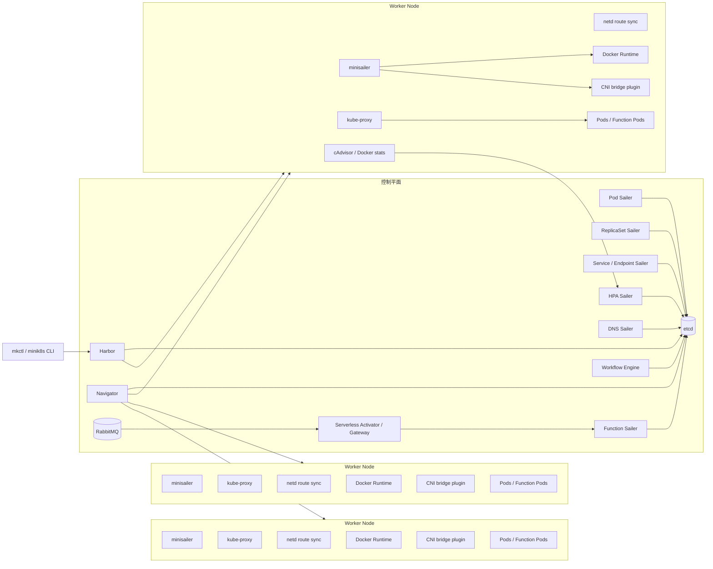

# Minik8s 项目架构与技术栈设计

## Summary

本项目采用“轻量 Kubernetes 控制面 + 多节点 Node Agent + Serverless 扩展”的架构。整体参考 Kubernetes，但不照搬全部复杂度：控制面负责声明式对象管理、调度、控制循环和状态持久化；Worker 节点负责容器运行、Pod 网络、Service 转发和资源上报；Serverless 作为自选功能建立在 Pod、Service、ReplicaSet、HPA 之上。

推荐主线：

- 基础编排：Pod、CNI、Service、ReplicaSet、HPA、DNS、多机、容错
- 自选功能：Serverless 平台
- 存储后端：开发期保留本地 JSON，集群模式切换到 etcd
- 容器运行时：Docker 优先，接口保留 containerd 扩展能力
- 网络：自研 CNI bridge + host-gw 路由同步，Service 用 iptables/IPVS

## Architecture

## Key Components

- **CLI / Harbor**
  - CLI 只负责解析命令、读取 YAML、向 Harbor 发请求。
  - Harbor 负责对象校验、默认值填充、REST API、watch 事件和持久化。
  - 支持对象：Pod、Service、ReplicaSet、HPA、DNS、Node、Function、Workflow。

- **etcd Store**
  - 集群模式统一使用 etcd 存储声明状态和运行状态。
  - key 设计按资源划分，例如 `/registry/pods/{namespace}/{name}`。
  - 现有 file store 可作为单机开发模式保留。

- **Navigator**
  - 监听 `spec.nodeName` 为空的 Pod。
  - 第一阶段使用 Round Robin / Least Pods 调度。
  - 跳过 NotReady 节点，后续可加入 CPU、Memory request 过滤。

- **minisailer**
  - 每个 Worker 节点运行一个。
  - 负责拉取本节点 Pod、创建 pause sandbox、启动业务容器、挂载 volume、调用 CNI、更新 Pod 状态。
  - 通过 heartbeat 向控制面汇报 Node 状态。
  - 容器异常退出后按 `restartPolicy` 重启。

- **CNI / netd**
  - 每个节点拥有独立 PodCIDR，例如 `10.244.0.0/24`。
  - CNI bridge 为 Pod 分配 IP，并接入本机 bridge。
  - netd 把 NodeIP + PodCIDR 注册到控制面或轻量 registry，并同步 host-gw 路由。
  - 满足同节点和跨节点 Pod IP 直连。

- **Service / kube-proxy**
  - Service Sailer 根据 selector 生成 endpoints。
  - kube-proxy 在每个节点同步 ClusterIP / NodePort 转发规则。
  - 实现优先级：iptables DNAT/RR 优先，IPVS 作为增强方案。
  - Service 屏蔽 Pod 所在节点位置。

- **DNS**
  - DNS 对象维护 host + path 到 Service 的映射。
  - 集群内可用 CoreDNS/dnsmasq 或自研 DNS proxy。
  - HTTP path 转发由轻量 Ingress Gateway 完成。

- **HPA**
  - 资源数据来自 cAdvisor 或 Docker stats。
  - 必选 CPU，第二指标建议选 Memory。
  - HPA Sailer 周期计算目标副本数，并更新 ReplicaSet `spec.replicas`。
  - 默认策略：每 15s 最多扩/缩 1 个副本，避免抖动。

## Serverless Extension

- **Function 抽象**
  - 用户上传 Python 文件或 zip。
  - Function Sailer 将 Function 转换成运行时 Pod 模板、ReplicaSet 和 Service。
  - 默认 runtime 镜像：Python + HTTP wrapper。
  - 每个函数暴露统一 HTTP invoke endpoint。

- **Activator / Gateway**
  - 所有函数请求先进入 Activator。
  - 若函数当前副本数为 0，Activator 触发冷启动，并等待 Service endpoint ready。
  - 请求量升高时更新 Function 对应 ReplicaSet 副本数。

- **scale-to-0**
  - Function 记录最近请求时间和当前并发数。
  - 空闲超过阈值，例如 60s，缩容到 0。
  - 冷启动后恢复到 1，压力升高时扩容到 `maxReplicas`。

- **Event Trigger**
  - RabbitMQ 作为事件总线。
  - 时间计划、文件变化或自定义事件写入 RabbitMQ。
  - Activator 消费事件并调用绑定 Function。

- **Workflow**
  - Workflow YAML 定义 DAG。
  - 支持顺序调用和基于上一步输出的分支。
  - Workflow Engine 调用 Function HTTP endpoint，并把前序输出作为后序输入。

## Technology Stack

| 层级 | 技术选型 |
|---|---|
| 主语言 | Go |
| CLI / 控制面服务 | Go `net/http` 或 Gin/Fiber，推荐先用标准库 |
| YAML 解析 | `gopkg.in/yaml.v3` |
| 状态存储 | etcd；本地开发保留 JSON file store |
| 容器运行时 | Docker SDK；通过 `ContainerRuntime` 接口兼容 containerd |
| Pod 网络 | 自研 CNI bridge plugin + host-gw route sync |
| Service 转发 | iptables，增强可选 IPVS |
| DNS / Path 转发 | CoreDNS/dnsmasq + 自研 HTTP gateway |
| 资源监控 | cAdvisor，Docker stats fallback |
| Serverless 事件 | RabbitMQ |
| Function runtime | Python HTTP wrapper + Docker image |
| 测试 | Go test、集成测试、三节点 VM smoke test |
| CI/CD | GitHub Actions |

## Public Interfaces

- `minik8s [--server http://127.0.0.1:18080] [-n namespace] apply -f xxx.yaml`
  - 通过 Harbor 提交 Pod、Service 等声明对象；默认 server 来自 `MINIK8S_HARBOR`。

- `minik8s get pods|po|services|svc|nodes|no [name] [-o table|json|yaml]`
  - 输出名称、namespace、labels、状态和关键运行信息；当前已实现 Pod、Service、Node。

- `minik8s describe pod|service|node <name>`
  - 查看单个资源详情，包括状态、labels、Service ports/endpoints 等。

- `minik8s delete pod|service <name> [-n namespace]`
  - 删除声明对象，并清理关联运行状态；同时支持 `delete pod/<name>`、`delete service/<name>`。

- `minik8s api-resources` / `minik8s version`
  - 通过 Harbor discovery endpoint 查看当前支持的资源和 API 版本。

- `minik8s invoke function <name> --data ...`
  - HTTP 触发函数。

- `minik8s apply -f workflow.yaml && minik8s invoke workflow <name>`
  - 触发函数链或 DAG。

## Test Plan

- 单机：Pod 创建、删除、重启、volume、port、resource limit。
- 网络：同节点 Pod IP 通信、跨节点 Pod IP 通信。
- Service：ClusterIP、NodePort、endpoint 动态更新、负载均衡。
- ReplicaSet：副本不足自动创建，副本过多自动删除。
- HPA：CPU/Memory 压力下扩容，空闲后缩容。
- DNS：域名 + path 转发到不同 Service。
- 多机：3 节点注册、调度、Node crash 后避免调度。
- 容错：控制面重启后从 etcd 恢复 Pod、Service、ReplicaSet、DNS、Function。
- Serverless：冷启动、scale-to-0、并发扩容、HTTP Trigger、Event Trigger、Workflow 分支。

## Assumptions

- 自选功能采用 **Serverless**，不实现完整 Service Mesh。
- Docker 是主要运行时，containerd 只保留接口扩展位。
- CNI 不直接依赖 Flannel，而是实现一个 Flannel host-gw 风格的轻量方案。
- RabbitMQ 只用于 Serverless 事件触发和异步工作流，不进入基础控制面关键路径。
- etcd 是最终集群状态源，本地 JSON 仅用于开发和早期单机演示。
