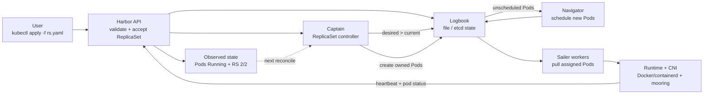
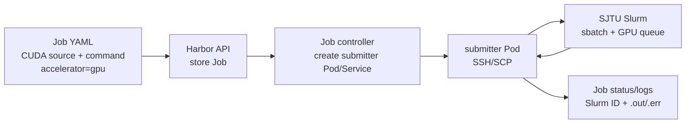

## 展示前 TODO | prep

- 准备 60cm x 90cm 竖版导出
- 补仓库二维码、运行截图、录屏二维码
- 准备 Serverless 自选功能展示
- 准备 CNI/双机/Logbook 兜底截图

## 摘要条 | strip

- **bridge**: apiserver 子集 + controller-manager 子集 + scheduler 子集
- **sailer**: kubelet 子集 + node network agent + kube-proxy

## Minik8s简介 跨列展示

图片抽象方向：把 ReplicaSet 建立过程画成“舰桥下达编队命令，水手把集装箱编成固定数量船队”的一张横向故事图。

- 左侧是用户提交的 `rs.yaml` 指令卷轴/命令卡片，箭头进入 Bridge 舰桥。
- Bridge 内部拆成 Harbor、Logbook、Captain、Navigator 四个小岗位：接收、记账、补齐 owned Pods、分配节点。
- 中间用一个醒目的 `desired 2 / current 0 -> current 2` 仪表表现 reconciliation，而不是展示过多 API 细节。
- 右侧是两个 Sailer worker 码头，各自启动一个带 `app=nginx-rs` 标签的小容器/Pod。
- 最后一条回流箭头表示 heartbeat/status 回写，让画面形成闭环：声明目标、创建副本、运行、回报、继续收敛。

- Kubernetes-like 资源工作流：apply、get、describe、delete。
- Bridge舰桥 control plane 负责状态存储、Pod 调度和 controllers。
- Sailer水手 worker 负责创建 Docker 容器并管理节点本地 data plane。
- File 或 etcd-backed Logbook 支持控制面重启后的对象恢复。

> TODO一个特性词云表示意图

## 系统架构 核心部分跨列

左图右文

> TODO 文字叙述各个架构职责交互

Bridge 组合 API、状态存储、调度和 controllers。Sailer 从控制面拉取 assigned Pods，创建 sandbox，执行 CNI，回写状态，并同步 Service 数据面规则。

## 实现特色（每个部分单成一格并左侧单列）

### 自研 CNI: mooring

兼容第三方CNI插件的基础上，实现自研CNI插件Mooring

支持 CNI ADD/DEL/CHECK，负责创建 bridge/veth、分配 Pod IP、写入默认路由，并配合 Sailer 同步 VXLAN/FDB/route。

在这里体现整体网络架构图

### Reconciliation & Heartbeat

Minik8s 采用 Kubernetes 风格的 reconciliation loop：用户提交的是期望状态，控制面
周期性比较 desired/current，并把差异收敛到实际集群。

- Service controller 维护 selector endpoints，Pod 增删、NodeLost 后自动刷新。
- ReplicaSet controller 维持 desired replicas，owned Pod 丢失后补齐副本。
- HPA controller 读取 Docker CPU/Memory metrics，按简化策略调整 ReplicaSet replicas。
- DNS、Job submitter、Serverless objects 也按对象状态驱动后续动作。

Heartbeat 是数据面容错入口：`sailer` 持续向 Harbor 上报 Node 状态、NodeIP、PodCIDR
和本地 Pod 状态；超时后 Node lifecycle controller 将 Node 标为 `Unknown`，把该节点
上的非终态 Pod 标记为 `NodeLost`，并触发 Service endpoints 与 ReplicaSet 副本重新收敛。

### Deps Pod & Addon Pod

> 图片留白：画一张 “Bridge private sailer 启动本地依赖 Pod” 的小图。左侧是
> `.minik8s/manifests/`，中间是 private sailer，右侧是 `storage-etcd`、`dns-gateway`、
> `metrics-server`、`serverless-nats` 四个依赖容器。

Minik8s 把控制面依赖也做成 static Pod manifest。`minik8s init` 只生成 manifest，
不启动进程；`bridge` 启动时读取这些文件，用私有本地 `sailer` 拉起核心依赖和被启用
的 addons。

Static pods / addon deps:

- `storage-etcd`: bridge 核心依赖，默认由 bridge 启动，用作 etcd-backed Logbook；
  bridge 通过 `MINIK8S_LOGBOOK_ENDPOINTS` / 本地 endpoint 连接它。
- `dns-gateway`: DNS addon 依赖，启用 `--addons dns` 后启动；bridge 的 DNS controller
  写入 DNS 对象，gateway/CoreDNS 侧按当前对象暴露 host/path 与域名解析能力。
- `metrics-server`: metrics addon 依赖，启用 `--addons metrics` 后启动；真实 metrics
  由 `sailer` 上报到 bridge，bridge 暴露最小 metrics API 并供 HPA 读取。
- `serverless-nats`: serverless addon 依赖，启用 `--addons serverless` 后启动；bridge
  将 Function/EventTrigger/Workflow 对象和 NATS endpoint 连接起来，事件通过 NATS
  进入最小执行链路。

交互方式：这些 deps/addon Pod 不经过公开集群调度器，而由 bridge 内部私有 worker
运行；它们为 Harbor、Logbook、DNS、metrics、serverless controllers 提供本地端口或
状态后端。用户通过 `--addons` 决定启用哪些 addon，未启用的 manifest 只保留在本地。

## Serverless （右单列，不强调自选，但换不同颜色）

自选功能展示教学版 Serverless API model。Function、EventTrigger 和 Workflow 都作为 Minik8s 一等资源接入 YAML loaders、Harbor APIs、file/etcd stores 和最小执行链路。

- `Function`: YAML 内联 Python function object。
- `EventTrigger`: 将事件配置连接到 Function references。
- `Workflow`: 表达 function chains 的最小 resource model。

Serverless样例图示

10个狗狗拼图

若干个arror表示使用 sam 指向一张狗狗的mask
> TOOD dog mask
若干个arrow表示evaluate指向一张狗狗排名图
> TODO dog rank

不展示限制：scale-to-0、可靠 ack/retry、dead-letter handling 和复杂 DAG execution 尚未完成。

## GPU Job 扩展 （右单列，不强调个人作业，但换颜色）

Minik8s 提供最小 Job + Slurm submitter 后端来模拟有GPU资源的任务的执行。GPU jobs 通过 `accelerator=gpu` 声明任务，提交 CUDA source 和 commands，并回收 Slurm `.out/.err` 日志。

流程说明：

- 用户提交 Job YAML，`kubectl apply` 会把 CUDA source 和 command 一起上传成 Job 对象。
- Harbor 存储 Job 后，Job controller 创建 submitter Pod/Service，用它作为连接外部 Slurm
  的执行代理。
- Submitter Pod 通过 SSH/SCP 把源码和脚本送到 SJTU Slurm，并执行 `sbatch` 进入 GPU 队列。
- Slurm 完成后，submitter 回收 job id、状态、`.out/.err` 日志，并回写到 Minik8s Job status。

工作流边界：Minik8s 不把 Slurm 节点纳入集群，也不是 GPU device plugin；它通过
submitter Pod 把 Job 对象桥接到外部 Slurm 队列，并把运行状态和日志回写到 Minik8s。

## 已知限制 (Poster不展示，确定文本避开)

- 未实现完整 Kubernetes watch/resourceVersion/admission/RBAC machinery。
- CNI、VXLAN、iptables 和 NodePort 演示依赖 Linux network tools 和 root 权限。
- Scheduler 是教学版简单策略，不做 resource-aware scheduling。
- PV/PVC 和 Security Context 尚未实现。
- Serverless 目前是 object model 和最小执行链路，还不是完整平台。

## 展示路径（Poster不展示）

1. `make build` 生成 `minik8s` 和 `kubectl`。
2. `minik8s init` 准备状态目录和 static manifests。
3. `minik8s bridge` 启动 Harbor、Logbook、scheduler 和 controllers。
4. `sailer join/run` 注册 workers 并接收 PodCIDR。
5. `kubectl apply` 创建 Pods、Services、ReplicaSets、HPA、DNS。
6. 通过 CLI 输出展示 Service endpoints、Pod IPs、Node status 和 Logbook recovery。
