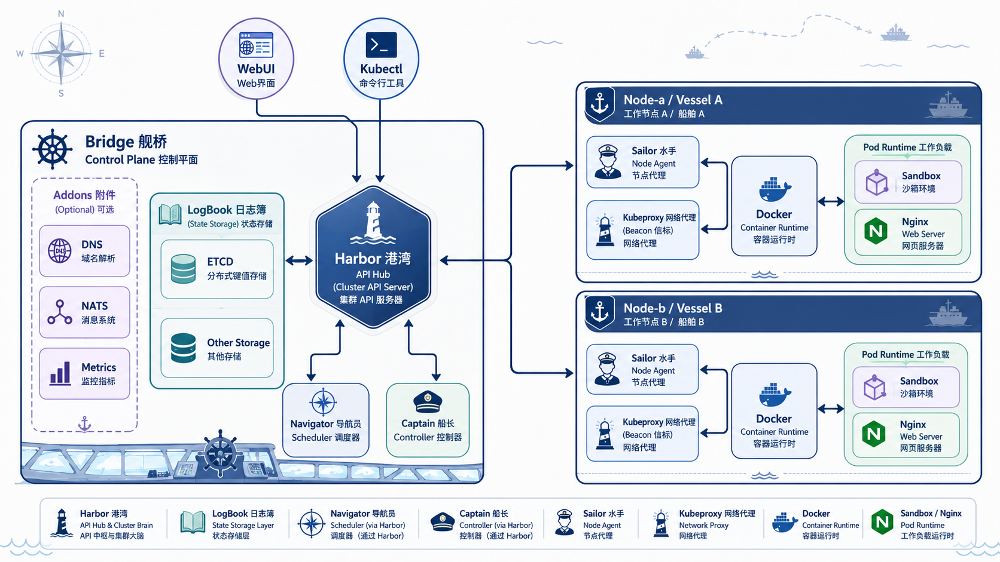

## 展示前 TODO | prep

- 准备 60cm x 90cm 竖版导出
- 补仓库二维码、运行截图、录屏二维码
- 准备 Serverless 自选功能展示
- 准备 CNI/双机/Logbook 兜底截图

## 摘要条 | strip

- **bridge**: apiserver 子集 + controller-manager 子集 + scheduler 子集
- **sailer**: kubelet 子集 + node network agent + kube-proxy

## Minik8s 特性简介

> TODO 补一张用户角度的示意图

- Kubernetes-like 资源工作流：apply、get、describe、delete。
- Bridge舰桥 control plane 负责状态存储、Pod 调度和 controllers。
- Sailer水手 worker 负责创建 Docker 容器并管理节点本地 data plane。
- File 或 etcd-backed Logbook 支持控制面重启后的对象恢复。

### 


## 系统架构 核心部分跨列介绍



> TODO 文字叙述各个架构职责交互

Bridge 组合 API、状态存储、调度和 controllers。Sailer 从控制面拉取 assigned Pods，创建 sandbox，执行 CNI，回写状态，并同步 Service 数据面规则。


## 网络架构
TODO

```network
```
## 实现特色

### 自研 CNI: mooring

mooring 实现 CNI ADD/DEL/CHECK，负责创建 bridge/veth、分配 Pod IP、写入默认路由，并配合 Sailer 同步 VXLAN/FDB/route。

### 统一reconciliation

Service endpoints、ReplicaSet replicas、HPA scaling、DNS snapshots、Job submitters 和 Serverless objects 都通过 Captain controllers 周期性收敛。

### Restart recovery

File 或 etcd-backed state 让 bridge 在重启后恢复声明对象；worker 继续 heartbeat 后，集群状态重新收敛。

## Serverless （Serverless 是自选功能但不用强调）

自选功能展示教学版 Serverless API model。Function、EventTrigger 和 Workflow 都作为 Minik8s 一等资源接入 YAML loaders、Harbor APIs、file/etcd stores 和最小执行链路。

- `Function`: YAML 内联 Python function object。
- `EventTrigger`: 将事件配置连接到 Function references。
- `Workflow`: 表达 function chains 的最小 resource model。

限制：scale-to-0、可靠 ack/retry、dead-letter handling 和复杂 DAG execution 尚未完成。

## GPU Job 扩展

Minik8s 提供最小 Job + Slurm submitter 后端。GPU jobs 通过 `accelerator=gpu` 声明任务，提交 CUDA source 和 commands，并回收 Slurm `.out/.err` 日志。

```flow
Job YAML | Submitter Pod | SSH / SCP | Slurm Queue | Logs
```

这不是 Kubernetes 原生 GPU device plugin，而是用于把 CUDA workload 提交到交我算 Slurm 平台的教学版后端。

## 已知限制

- 未实现完整 Kubernetes watch/resourceVersion/admission/RBAC machinery。
- CNI、VXLAN、iptables 和 NodePort 演示依赖 Linux network tools 和 root 权限。
- Scheduler 是教学版简单策略，不做 resource-aware scheduling。
- PV/PVC 和 Security Context 尚未实现。
- Serverless 目前是 object model 和最小执行链路，还不是完整平台。

## 展示路径 | span-2

1. `make build` 生成 `minik8s` 和 `kubectl`。
2. `minik8s init` 准备状态目录和 static manifests。
3. `minik8s bridge` 启动 Harbor、Logbook、scheduler 和 controllers。
4. `sailer join/run` 注册 workers 并接收 PodCIDR。
5. `kubectl apply` 创建 Pods、Services、ReplicaSets、HPA、DNS。
6. 通过 CLI 输出展示 Service endpoints、Pod IPs、Node status 和 Logbook recovery。

```screenshots
get pods -o wide | describe service
ReplicaSet recovery | Logbook restart
```
