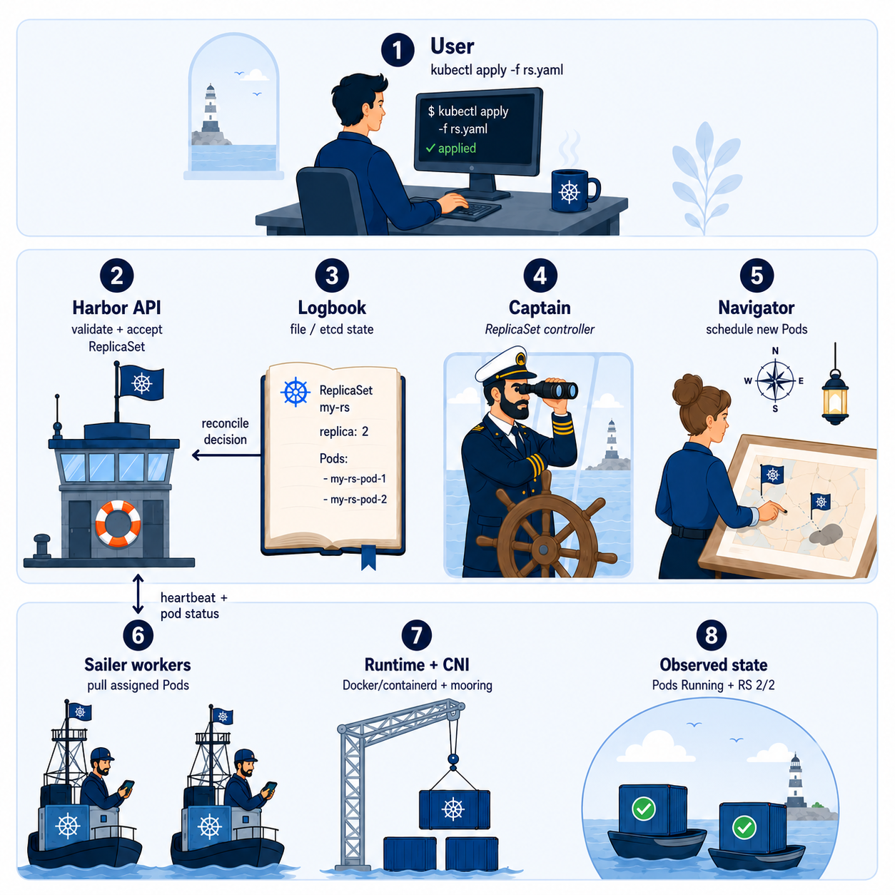
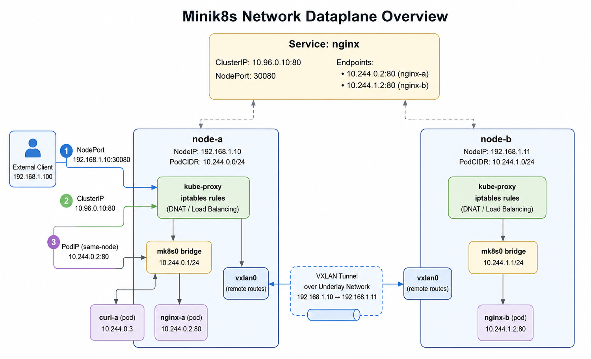
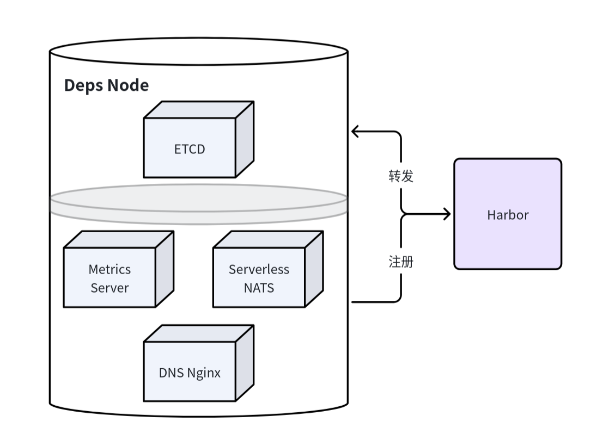
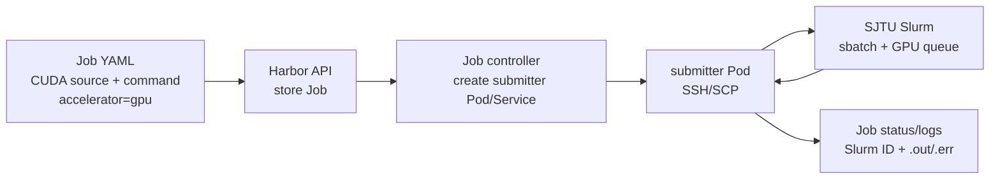

## 展示前准备 | prep

- 准备 60cm x 90cm 竖版导出
- 补仓库二维码、运行截图、录屏二维码
- 准备 Serverless 自选功能展示
- 准备 CNI/双机/Logbook 兜底截图

## Minik8s简介 跨列展示



- Kubernetes-like 资源工作流：apply、get、describe、delete。
- Bridge舰桥 control plane 负责状态存储、Pod 调度和 controllers。
- Sailer水手 worker 负责创建 Docker 容器并管理节点本地 data plane。
- Kubectl CLI 通过 Harbor API 与系统交互，展示资源状态和日志。

Features:

- Kubernetes 风格 CLI：`apply` / `get` / `describe` / `delete` / `top`。
- Pod lifecycle：Docker sandbox、workload container、volume、port、restart policy。
- 自研 CNI：mooring bridge/veth/IPAM，支持同节点与跨节点 PodCIDR 通信。
- Service：ClusterIP、NodePort、selector endpoints 和 iptables 简化负载均衡。
- Workload controllers：ReplicaSet、HPA、Node lifecycle、Service endpoint reconcile。
- Multi-node：Node join、heartbeat、PodCIDR 分配、Ready/Unknown 状态和简单调度。
- Addons：DNS host/path gateway、metrics、Serverless NATS dependency。
- Logbook：本地 JSON 状态恢复；可切换到 etcd-backed store。
- Extended Jobs：GPU Job 通过 submitter Pod 桥接外部 Slurm 队列。

## 系统架构 核心部分跨列

左图右文


Minik8s 把控制面和节点面拆成一条清晰的对象流。用户用 `kubectl` 提交 YAML，
Harbor 接收 Pod、Service、ReplicaSet、HPA、DNS、Job 和 Serverless 对象，并写入
Logbook。Logbook 默认落本地 JSON，启用 `MINIK8S_LOGBOOK_ENDPOINTS` 后切换到
etcd-backed store，让控制面重启后可以恢复声明式对象。

Bridge 组合 Harbor API、Logbook、Navigator 和 Captain controllers。Navigator 为
Pending Pod 选择 Ready Node 并写入 `spec.nodeName`；Captain 周期性收敛 Service
endpoints、ReplicaSet replicas、HPA replicas 和 Node lifecycle。Sailer 运行在每个
worker 上，通过 heartbeat 注册 Node 状态，拉取分配给本节点的 Pods，创建 Docker
sandbox，执行 CNI，回写 Pod 状态，并把 Service 对象同步成本机 iptables 规则。

数据面由 mooring CNI、netagent 和 kube-proxy 组成。mooring 为 Pod 创建 bridge/veth、
分配 Pod IP 和默认路由；netagent 根据 Node PodCIDR 同步 VXLAN/FDB/route，支撑跨节点
Pod 通信；kube-proxy 把 ClusterIP/NodePort 转换成 NAT 规则，把稳定虚拟入口转发到当前
endpoints。DNS、metrics、serverless 等 addon 以 static Pod manifest 方式接入 Bridge，
作为可选依赖参与同一套对象和 reconcile 流程。

## 实现特色（每个部分单成一格并左侧单列）

### 自研 CNI: mooring

兼容第三方CNI插件的基础上，实现自研CNI插件Mooring

支持 CNI ADD/DEL/CHECK，负责创建 bridge/veth、分配 Pod IP、写入默认路由，并配合 Sailer 同步 VXLAN/FDB/route。

在这里体现整体网络架构图


### Reconciliation & Heartbeat

Minik8s 采用 Kubernetes 风格的 reconciliation loop：用户提交的是期望状态，控制面
周期性比较 desired/current，并把差异收敛到实际集群。

- Service controller 维护 selector endpoints，Pod 增删、NodeLost 后自动刷新。
- ReplicaSet controller 维持 desired replicas，owned Pod 丢失后补齐副本。
- HPA controller 读取 Docker CPU/Memory metrics，按简化策略调整 ReplicaSet replicas。
- DNS、Job submitter、Serverless objects 也按对象状态驱动后续动作。

Heartbeat 是数据面容错入口：`sailer` 持续向 Harbor 上报 Node 状态、NodeIP、PodCIDR
和本地 Pod 状态；超时后 Node lifecycle controller 将 Node 标为 `Unknown`，把该节点
上的非终态 Pod 标记为 `NodeLost`，并触发 Service endpoints 与 ReplicaSet 副本重新收敛。

### Deps Pod & Addon Pod



Minik8s 把控制面依赖也做成 static Pod manifest。`minik8s init` 只生成 manifest，
不启动进程；`bridge` 启动时读取这些文件，用私有本地 `sailer` 拉起核心依赖和被启用
的 addons，极大减少启动依赖。

Static pods / addon deps如何接入系统:

- `storage-etcd`: bridge 核心依赖，默认由 bridge 启动，用作 etcd-backed Logbook；
  bridge 通过 `MINIK8S_LOGBOOK_ENDPOINTS` / 本地 endpoint 连接它。
- `dns-gateway`: DNS addon 依赖，启用 `--addons dns` 后启动；bridge 的 DNS controller
  写入 DNS 对象，gateway/CoreDNS 侧按当前对象暴露 host/path 与域名解析能力。
- `metrics-server`: metrics addon 依赖，启用 `--addons metrics` 后启动；真实 metrics
  由 `sailer` 上报到 bridge，bridge 暴露最小 metrics API 并供 HPA 读取。
- `serverless-nats`: serverless addon 依赖，启用 `--addons serverless` 后启动；bridge
  将 Function/EventTrigger/Workflow 对象和 NATS endpoint 连接起来，事件通过 NATS
  进入最小执行链路。

交互方式：这些 deps/addon Pod 不经过公开集群调度器，而由 bridge 内部私有 worker
运行；它们为 Harbor、Logbook、DNS、metrics、serverless controllers 提供本地端口或
状态后端。用户通过 `--addons` 决定启用哪些 addon，未启用的 manifest 只保留在本地。

## Serverless （右单列，不强调自选，但换不同颜色）

基于 Minik8s 控制面实现教学版 Serverless 闭环。Function、EventTrigger 和 Workflow 都作为一等资源接入 YAML loaders、Harbor APIs、file/etcd stores；调用统一进入 NATS request/reply，再由 invocation worker 和 Activator 完成冷启动、扩缩容和 Pod `/invoke` 转发。

- `Function`: 支持内联 Python 和自定义容器镜像；Function controller 映射为 `fn-*` ReplicaSet + Service，并维护 revision/update/delete。
- `NATS`: Serverless addon 启动 NATS；CLI/HTTP invoke、EventTrigger 和 Workflow step 都通过 request/reply 进入统一调用入口。
- `Invocation Worker`: 订阅 `minik8s.serverless.invoke` queue group，解析 namespace/function/data，并把请求交给 Activator。
- `Activator`: 冷启动时把 ReplicaSet 从 0 拉到 1，等待 Running、PodIP 和 TCP 可达后转发 HTTP `/invoke`。
- `EventTrigger`: 订阅 NATS subject，收到事件后复用同一条 invoke path 调用 Function。
- `Workflow`: 支持同步函数链、step 间数据传递，以及基于 contains/regex 输出匹配的分支。

Serverless样例图示

版式方案：三张图片放在 Serverless 模块右侧/下半区竖排，形成一条 demo pipeline：

```text
Input batch
  | SAM mask
Masked target
  | Evaluate
Rank result
```

图片外框弱化，只保留轻边界和 caption，避免三张图像硬卡片一样抢注意力。

10个狗狗拼图

若干个arror表示使用 sam 指向一张狗狗的mask

若干个arrow表示通过evaluate指向一张狗狗排名图


不展示或仅小字展示限制：可靠 ack/retry、dead-letter handling 和复杂持久化 DAG execution 尚未完成。

## GPU Job 扩展 （右单列，不强调个人作业，但换颜色）

Minik8s 提供最小 Job + Slurm submitter 后端来模拟有GPU资源的任务的执行。GPU jobs 通过 `accelerator=gpu` 声明任务，提交 CUDA source 和 commands，并回收 Slurm `.out/.err` 日志。



流程说明：

- 用户提交 Job YAML，`kubectl apply` 会把 CUDA source 和 command 一起上传成 Job 对象。
- Harbor 存储 Job 后，Job controller 创建 submitter Pod/Service，用它作为连接外部 Slurm
  的执行代理。
- Submitter Pod 通过 SSH/SCP 把源码和脚本送到 SJTU Slurm，并执行 `sbatch` 进入 GPU 队列。
- Slurm 完成后，submitter 回收 job id、状态、`.out/.err` 日志，并回写到 Minik8s Job status。

工作流边界：Minik8s 不把 Slurm 节点纳入集群，也不是 GPU device plugin；它通过
submitter Pod 把 Job 对象桥接到外部 Slurm 队列，并把运行状态和日志回写到 Minik8s。

## 已知限制 (Poster不展示，确定文本避开)

- 未实现完整 Kubernetes watch/resourceVersion/admission/RBAC machinery。
- CNI、VXLAN、iptables 和 NodePort 演示依赖 Linux network tools 和 root 权限。
- Scheduler 是教学版简单策略，不做 resource-aware scheduling。
- PV/PVC 和 Security Context 尚未实现。
- Serverless 目前是 object model 和最小执行链路，还不是完整平台。

## 展示路径（Poster不展示）

1. `make build` 生成 `minik8s` 和 `kubectl`。
2. `minik8s init` 准备状态目录和 static manifests。
3. `minik8s bridge` 启动 Harbor、Logbook、scheduler 和 controllers。
4. `sailer join/run` 注册 workers 并接收 PodCIDR。
5. `kubectl apply` 创建 Pods、Services、ReplicaSets、HPA、DNS。
6. 通过 CLI 输出展示 Service endpoints、Pod IPs、Node status 和 Logbook recovery。
